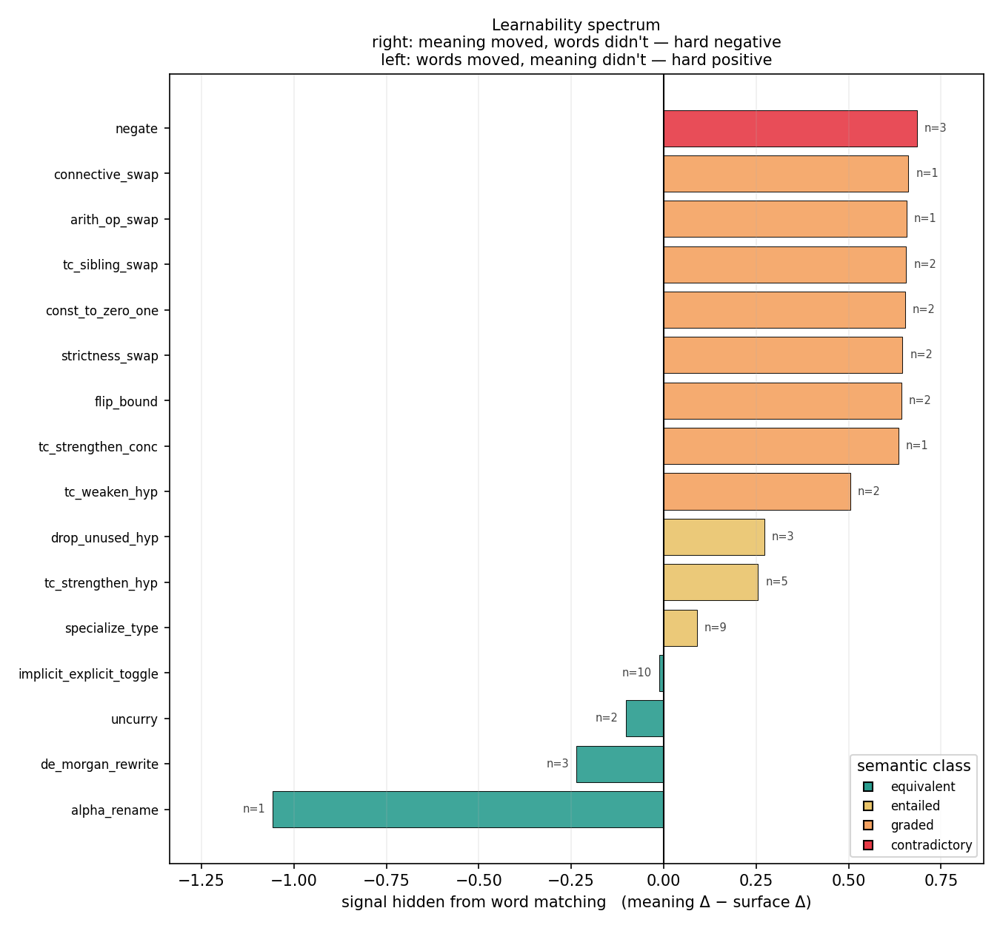
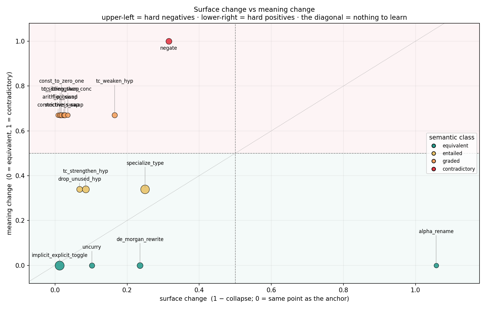
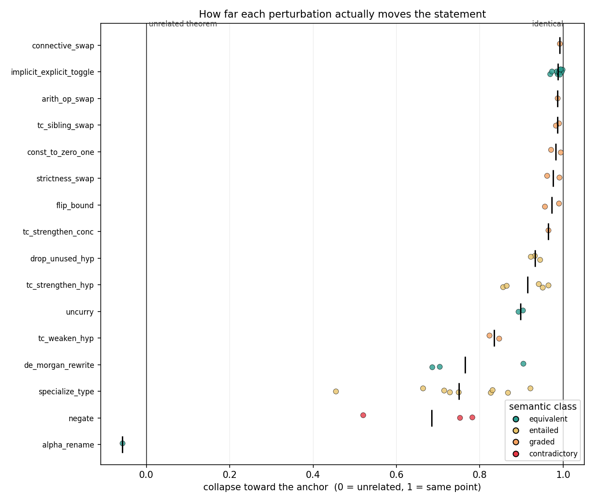
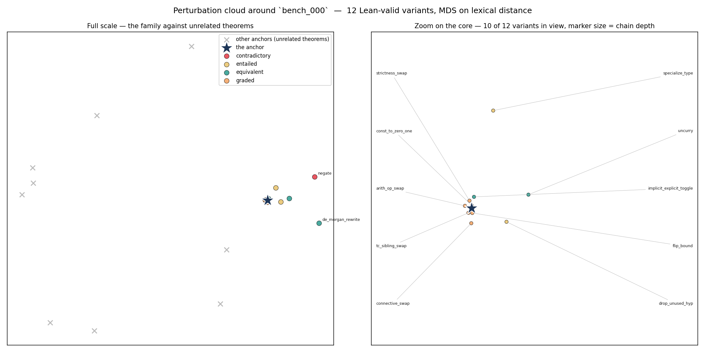

# Where do the perturbed statements sit?

49 variants across 10 anchors, scored with 4 lexical (non-neural) similarity views. No model is involved: these numbers are what pure word matching can see.

## Baseline — two unrelated theorems

Similarity between *different* anchors. This is the zero point: any two statements drawn from the benchmark sit about this far apart, so it is the scale against which 'close to the anchor' has to be read.

| View | mean | std | min | max |
|---|---|---|---|---|
| TF-IDF over Lean tokens (bag of words) | **0.346** | 0.192 | 0.131 | 0.916 |
| TF-IDF over character 3–5-grams (subword surface form) | **0.214** | 0.179 | 0.034 | 0.735 |
| Token-set overlap (order-blind word matching) | **0.391** | 0.135 | 0.200 | 0.875 |
| Token-sequence alignment (order-aware) | **0.383** | 0.128 | 0.183 | 0.809 |

_(45 anchor pairs.)_

## Variants against their own anchor

`collapse` rescales the raw similarity so that **0.0 means the variant is as far from its anchor as an unrelated theorem is, and 1.0 means it sits on the same point**.

| View | raw similarity | collapse |
|---|---|---|
| TF-IDF over Lean tokens (bag of words) | 0.914 ± 0.120 | **0.868** ± 0.184 |
| TF-IDF over character 3–5-grams (subword surface form) | 0.888 ± 0.131 | **0.857** ± 0.167 |
| Token-set overlap (order-blind word matching) | 0.868 ± 0.125 | **0.783** ± 0.206 |
| Token-sequence alignment (order-aware) | 0.897 ± 0.111 | **0.833** ± 0.179 |

## Retrieval — does a variant still find its own anchor?

**48/49 (98%)** of variants rank their own anchor first among all 10 anchors under tf-idf over lean tokens (bag of words).

## Per-perturbation

Grouped by the last step of the path. `surface Δ` is `1 − collapse`: how far that one perturbation moved the statement in surface terms, measured against **the statement it was applied to** rather than the anchor — otherwise a step deep in a chain is charged for all the drift its ancestors caused. `meaning Δ` is the logical distance implied by the truth-propagation table (0 equivalent, 0.34 entailed, 0.67 graded, 1.0 contradictory).

`signal` is `meaning Δ − surface Δ`, the whole point of the exercise: **how much of the change is invisible to word matching**. Large positive means the meaning moved and the surface did not (a hard negative — the model has to read the logic). Large negative means the surface moved and the meaning did not (a hard positive). Near zero means surface overlap already gives away the answer, so the pair teaches an embedder nothing it doesn't already know.

| Perturbation | class | n | collapse | surface Δ | surface Δ (order-aware) | meaning Δ | signal | verdict |
|---|---|---|---|---|---|---|---|---|
| `negate` | contradictory | 3 | 0.684 | 0.316 | 0.689 | 1.00 | **+0.68** | **hard negative** — looks the same, means something else |
| `connective_swap` | graded | 1 | 0.991 | 0.009 | 0.013 | 0.67 | **+0.66** | **hard negative** — looks the same, means something else |
| `arith_op_swap` | graded | 1 | 0.987 | 0.013 | 0.013 | 0.67 | **+0.66** | **hard negative** — looks the same, means something else |
| `tc_sibling_swap` | graded | 2 | 0.986 | 0.014 | 0.015 | 0.67 | **+0.66** | **hard negative** — looks the same, means something else |
| `const_to_zero_one` | graded | 2 | 0.982 | 0.018 | 0.026 | 0.67 | **+0.65** | **hard negative** — looks the same, means something else |
| `strictness_swap` | graded | 2 | 0.976 | 0.024 | 0.026 | 0.67 | **+0.65** | **hard negative** — looks the same, means something else |
| `flip_bound` | graded | 2 | 0.973 | 0.027 | 0.026 | 0.67 | **+0.64** | **hard negative** — looks the same, means something else |
| `tc_strengthen_conc` | graded | 1 | 0.964 | 0.036 | 0.033 | 0.67 | **+0.63** | **hard negative** — looks the same, means something else |
| `tc_weaken_hyp` | graded | 2 | 0.835 | 0.165 | 0.064 | 0.67 | **+0.50** | moderate negative — surface hints at the change |
| `drop_unused_hyp` | entailed | 3 | 0.932 | 0.068 | 0.208 | 0.34 | **+0.27** | moderate negative — surface hints at the change |
| `tc_strengthen_hyp` | entailed | 5 | 0.915 | 0.085 | 0.048 | 0.34 | **+0.26** | moderate negative — surface hints at the change |
| `specialize_type` | entailed | 9 | 0.750 | 0.250 | 0.253 | 0.34 | **+0.09** | aligned — surface overlap already gives the answer |
| `implicit_explicit_toggle` | equivalent | 10 | 0.987 | 0.013 | 0.078 | 0.00 | **-0.01** | aligned — surface overlap already gives the answer |
| `uncurry` | equivalent | 2 | 0.898 | 0.102 | 0.252 | 0.00 | **-0.10** | aligned — surface overlap already gives the answer |
| `de_morgan_rewrite` | equivalent | 3 | 0.764 | 0.236 | 0.288 | 0.00 | **-0.24** | **hard positive** — looks different, means the same |
| `alpha_rename` | equivalent | 1 | -0.057 | 1.057 | 0.463 | 0.00 | **-1.06** | **extreme positive** — further away than an unrelated theorem |

The `order-aware` column repeats the measurement under token-sequence alignment instead of a bag of words, which separates two very different reasons a perturbation can score near zero.

**Single-token substitutions** stay near zero in *both* columns. These swap one common symbol for another (`≤` for `<`, `0` for `1`); common symbols carry almost no IDF weight and almost no alignment cost, so they are hidden from lexical matching however it is measured. What that is worth depends entirely on whether the meaning moved with them:

* meaning *did* move — `arith_op_swap`, `connective_swap`, `const_to_zero_one`, `flip_bound`, `strictness_swap`, `tc_sibling_swap`, `tc_strengthen_conc`. **The most reliable hard negatives in the set.**

## Inversion — is surface similarity even pointing the right way?

Across 67 (equivalent, non-equivalent) variant pairs sharing an anchor, the **non-equivalent** variant was lexically closer to the anchor **28 times (42%)**.

> Surface similarity mostly points the right way, so a word-matching model can score well on this set without understanding it. These pairs are weak training signal.

The aggregate hides most of the story, because it is dominated by whichever equivalence-preserving perturbation fires most often. Split by the positive side of the pair:

| Equivalent variant | pairs | beaten by a non-equivalent variant |
|---|---|---|
| `alpha_rename` | 1 | **1 (100%)** |
| `de_morgan_rewrite` | 20 | **17 (85%)** |
| `uncurry` | 13 | **10 (77%)** |
| `implicit_explicit_toggle` | 33 | **0 (0%)** |

A row near 100% is a perturbation whose *positive* pair a lexical model would rank below a *negative* pair of the same anchor — the exact case where word matching gives the wrong answer and logic gives the right one.

Dropping positives that barely edit the string at all (`implicit_explicit_toggle` — a positive that changes nothing cannot be beaten), the rate is **28/34 (82%)**. That is the number to quote: among pairs where the equivalence-preserving rewrite actually rewrote something, surface similarity points the wrong way most of the time.

## Figures

