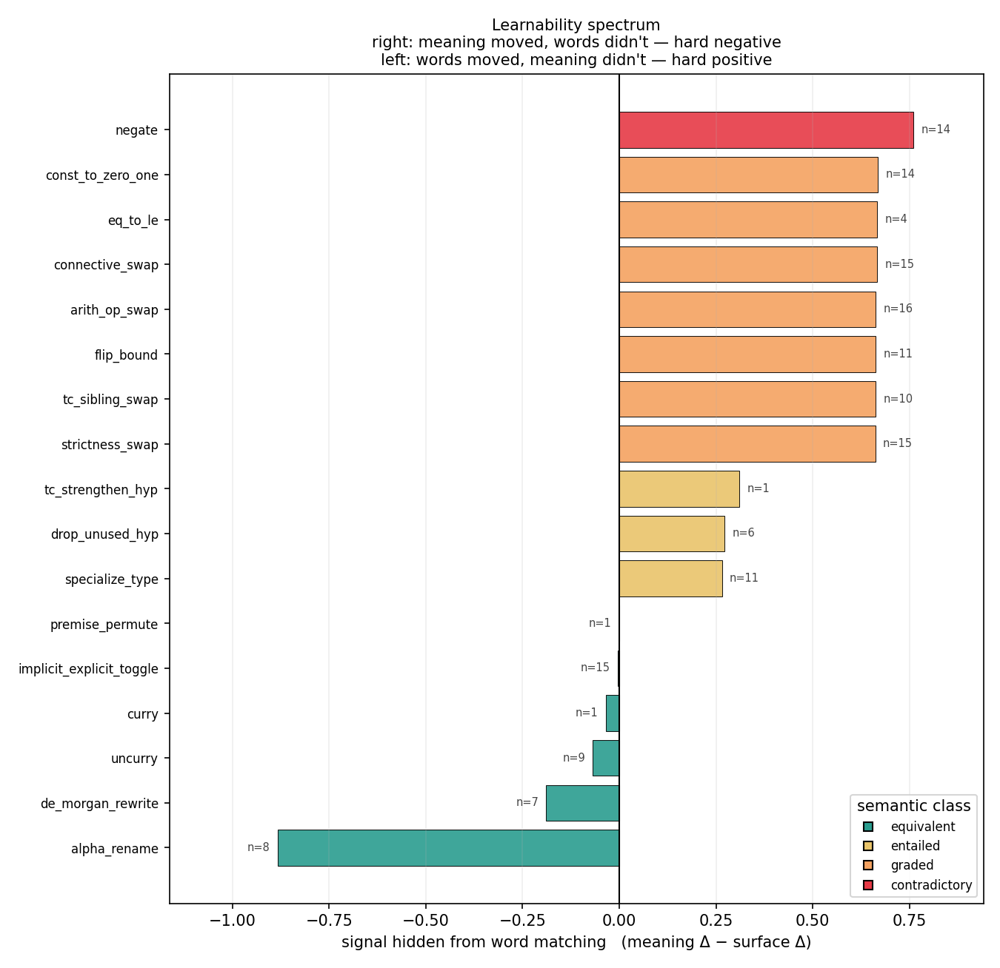
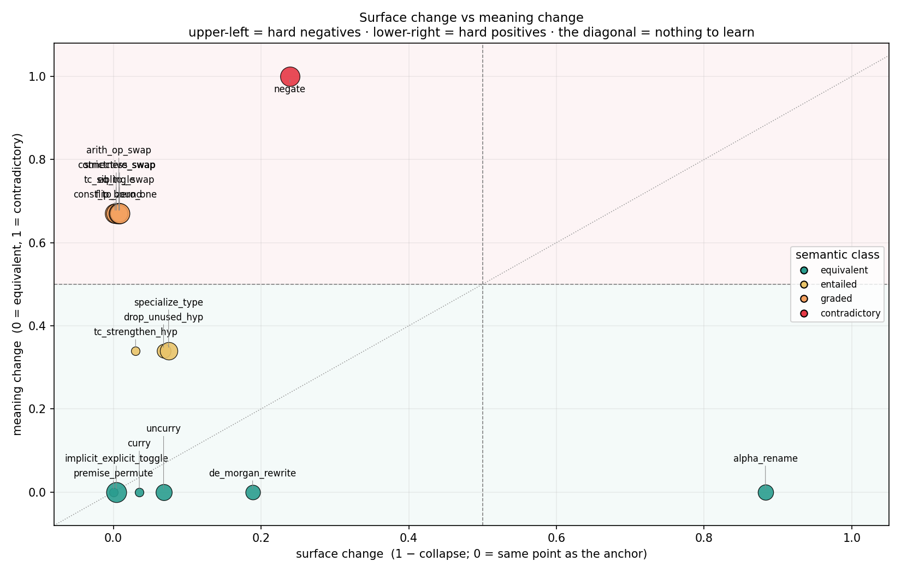
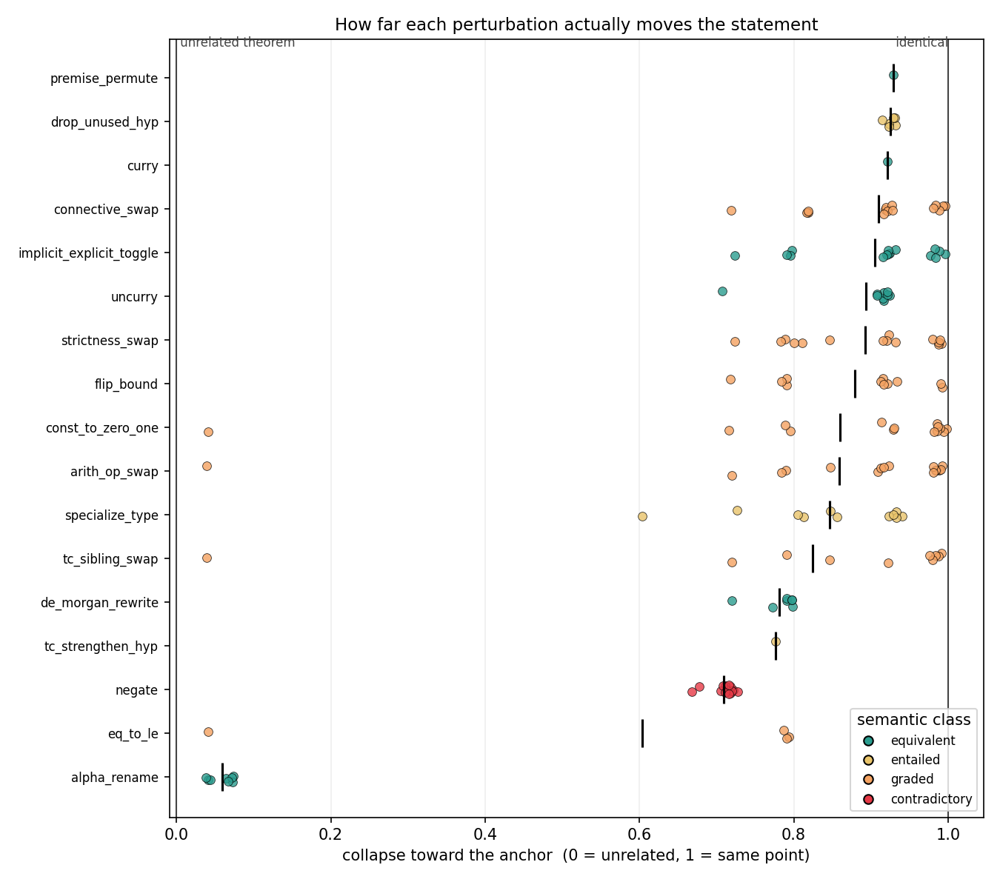
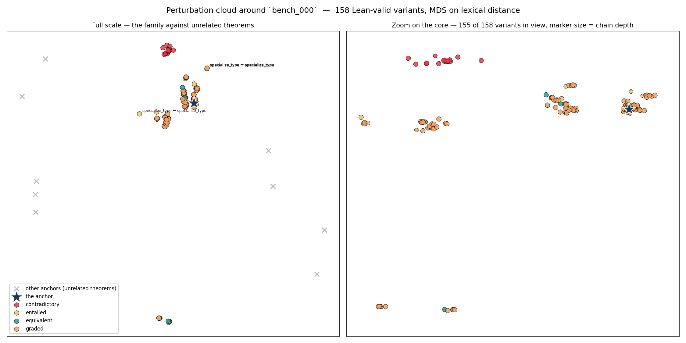

# Where do the perturbed statements sit?

158 variants across 1 anchor, scored with 4 lexical (non-neural) similarity views. No model is involved: these numbers are what pure word matching can see.

_9 further theorems are included as reference points only, to fix the distance scale._

## Baseline — two unrelated theorems

Similarity between *different* anchors. This is the zero point: any two statements drawn from the benchmark sit about this far apart, so it is the scale against which 'close to the anchor' has to be read.

| View | mean | std | min | max |
|---|---|---|---|---|
| TF-IDF over Lean tokens (bag of words) | **0.272** | 0.223 | 0.061 | 0.912 |
| TF-IDF over character 3–5-grams (subword surface form) | **0.142** | 0.146 | 0.017 | 0.685 |
| Token-set overlap (order-blind word matching) | **0.391** | 0.135 | 0.200 | 0.875 |
| Token-sequence alignment (order-aware) | **0.383** | 0.128 | 0.183 | 0.809 |

_(45 anchor pairs.)_

## Variants against their own anchor

`collapse` rescales the raw similarity so that **0.0 means the variant is as far from its anchor as an unrelated theorem is, and 1.0 means it sits on the same point**.

| View | raw similarity | collapse |
|---|---|---|
| TF-IDF over Lean tokens (bag of words) | 0.862 ± 0.173 | **0.811** ± 0.238 |
| TF-IDF over character 3–5-grams (subword surface form) | 0.875 ± 0.153 | **0.855** ± 0.178 |
| Token-set overlap (order-blind word matching) | 0.767 ± 0.127 | **0.617** ± 0.208 |
| Token-sequence alignment (order-aware) | 0.802 ± 0.147 | **0.680** ± 0.238 |

## Does chaining move the statement further?

One perturbation barely moves a statement. The question a deep run answers is whether *composing* them escapes the anchor's neighbourhood, or whether the tree just fills in the same tiny blob.

| Depth | variants | mean collapse | min | still nearest to its anchor |
|---|---|---|---|---|
| 1 | 12 | 0.940 | 0.722 | 12/12 (100%) |
| 2 | 40 | 0.885 | 0.041 | 40/40 (100%) |
| 3 | 106 | 0.768 | 0.039 | 106/106 (100%) |

## Retrieval — does a variant still find its own anchor?

**158/158 (100%)** of variants rank their own anchor first among all 10 anchors under tf-idf over lean tokens (bag of words).

## Per-perturbation

Grouped by the last step of the path. `surface Δ` is `1 − collapse`: how far that one perturbation moved the statement in surface terms, measured against **the statement it was applied to** rather than the anchor — otherwise a step deep in a chain is charged for all the drift its ancestors caused. `meaning Δ` is the logical distance implied by the truth-propagation table (0 equivalent, 0.34 entailed, 0.67 graded, 1.0 contradictory).

`signal` is `meaning Δ − surface Δ`, the whole point of the exercise: **how much of the change is invisible to word matching**. Large positive means the meaning moved and the surface did not (a hard negative — the model has to read the logic). Large negative means the surface moved and the meaning did not (a hard positive). Near zero means surface overlap already gives away the answer, so the pair teaches an embedder nothing it doesn't already know.

| Perturbation | class | n | collapse | surface Δ | surface Δ (order-aware) | meaning Δ | signal | verdict |
|---|---|---|---|---|---|---|---|---|
| `negate` | contradictory | 14 | 0.761 | 0.239 | 0.546 | 1.00 | **+0.76** | **hard negative** — looks the same, means something else |
| `const_to_zero_one` | graded | 14 | 0.998 | 0.002 | 0.013 | 0.67 | **+0.67** | **hard negative** — looks the same, means something else |
| `eq_to_le` | graded | 4 | 0.996 | 0.004 | 0.013 | 0.67 | **+0.67** | **hard negative** — looks the same, means something else |
| `connective_swap` | graded | 15 | 0.996 | 0.004 | 0.013 | 0.67 | **+0.67** | **hard negative** — looks the same, means something else |
| `arith_op_swap` | graded | 16 | 0.993 | 0.007 | 0.013 | 0.67 | **+0.66** | **hard negative** — looks the same, means something else |
| `flip_bound` | graded | 11 | 0.992 | 0.008 | 0.013 | 0.67 | **+0.66** | **hard negative** — looks the same, means something else |
| `tc_sibling_swap` | graded | 10 | 0.992 | 0.008 | 0.013 | 0.67 | **+0.66** | **hard negative** — looks the same, means something else |
| `strictness_swap` | graded | 15 | 0.992 | 0.008 | 0.013 | 0.67 | **+0.66** | **hard negative** — looks the same, means something else |
| `tc_strengthen_hyp` | entailed | 1 | 0.970 | 0.030 | 0.013 | 0.34 | **+0.31** | moderate negative — surface hints at the change |
| `drop_unused_hyp` | entailed | 6 | 0.932 | 0.068 | 0.226 | 0.34 | **+0.27** | moderate negative — surface hints at the change |
| `specialize_type` | entailed | 11 | 0.925 | 0.075 | 0.095 | 0.34 | **+0.27** | moderate negative — surface hints at the change |
| `premise_permute` | equivalent | 1 | 1.000 | 0.000 | 0.052 | 0.00 | **-0.00** | aligned — surface overlap already gives the answer |
| `implicit_explicit_toggle` | equivalent | 15 | 0.996 | 0.004 | 0.026 | 0.00 | **-0.00** | aligned — surface overlap already gives the answer |
| `curry` | equivalent | 1 | 0.965 | 0.035 | 0.053 | 0.00 | **-0.04** | aligned — surface overlap already gives the answer |
| `uncurry` | equivalent | 9 | 0.932 | 0.068 | 0.222 | 0.00 | **-0.07** | aligned — surface overlap already gives the answer |
| `de_morgan_rewrite` | equivalent | 7 | 0.811 | 0.189 | 0.265 | 0.00 | **-0.19** | **hard positive** — looks different, means the same |
| `alpha_rename` | equivalent | 8 | 0.117 | 0.883 | 0.442 | 0.00 | **-0.88** | **extreme positive** — further away than an unrelated theorem |

The `order-aware` column repeats the measurement under token-sequence alignment instead of a bag of words, which separates two very different reasons a perturbation can score near zero.

**Single-token substitutions** stay near zero in *both* columns. These swap one common symbol for another (`≤` for `<`, `0` for `1`); common symbols carry almost no IDF weight and almost no alignment cost, so they are hidden from lexical matching however it is measured. What that is worth depends entirely on whether the meaning moved with them:

* meaning *did* move — `arith_op_swap`, `connective_swap`, `const_to_zero_one`, `eq_to_le`, `flip_bound`, `strictness_swap`, `tc_sibling_swap`, `tc_strengthen_hyp`. **The most reliable hard negatives in the set.**
* meaning did *not* move — `implicit_explicit_toggle`. Invisible and equivalent, so the pair asserts something the model already believes. No training signal either way.

## Inversion — is surface similarity even pointing the right way?

Across 1617 (equivalent, non-equivalent) variant pairs sharing an anchor, the **non-equivalent** variant was lexically closer to the anchor **905 times (56%)**.

> Surface similarity is **anti-correlated** with logical similarity here. A model scoring by word overlap does not merely fail to learn the logic — it is actively pulled the wrong way, which is a plausible explanation for the natural-language training result.

The aggregate hides most of the story, because it is dominated by whichever equivalence-preserving perturbation fires most often. Split by the positive side of the pair:

| Equivalent variant | pairs | beaten by a non-equivalent variant |
|---|---|---|
| `alpha_rename` | 441 | **422 (96%)** |
| `de_morgan_rewrite` | 147 | **92 (63%)** |
| `curry` | 147 | **62 (42%)** |
| `implicit_explicit_toggle` | 735 | **279 (38%)** |
| `uncurry` | 147 | **50 (34%)** |

A row near 100% is a perturbation whose *positive* pair a lexical model would rank below a *negative* pair of the same anchor — the exact case where word matching gives the wrong answer and logic gives the right one.

Dropping positives that barely edit the string at all (`curry`, `implicit_explicit_toggle` — a positive that changes nothing cannot be beaten), the rate is **564/735 (77%)**. That is the number to quote: among pairs where the equivalence-preserving rewrite actually rewrote something, surface similarity points the wrong way most of the time.

## Figures

